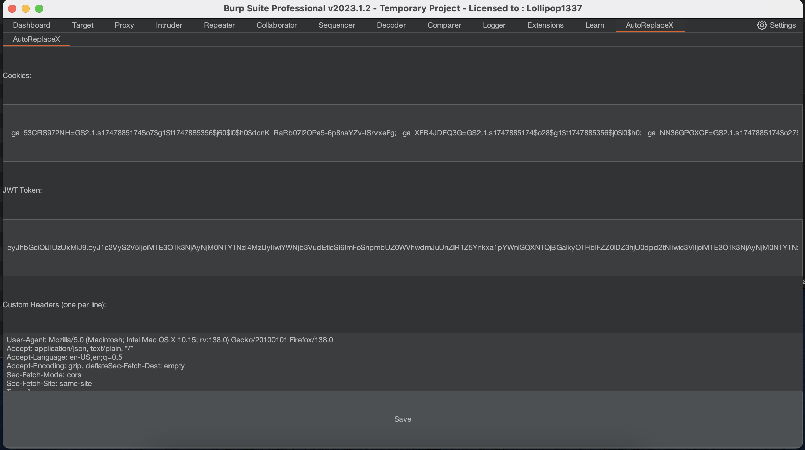

# AutoReplaceX

**AutoReplaceX** is a Burp Suite extension designed to simplify the process of managing and replacing HTTP headers, cookies, and JWT tokens in HTTP requests. It provides a user-friendly interface for saving custom headers, cookies, and JWTs, and allows users to apply these modifications to requests sent to Burp's Repeater tool or directly within the message editor.

---

## 📸 Screenshot

 <!-- Replace with actual path or URL -->

---

## 🔧 Features

- **Header Management**: Store and apply custom HTTP headers, cookies, and JWT tokens via a dedicated UI tab.
- **Context Menu Integration**: Right-click options to send requests to Burp's Repeater with replaced cookies, JWTs, or full headers, or to extract headers/cookies/JWTs to the extension's UI.
- **Message Editor Tab**: View and edit requests with automatic header replacement functionality.
- **Persistent Settings**: Save and load configurations (cookies, JWTs, and headers) using Burp's extension settings.
- **Customizable Workflow**: Easily apply stored headers to requests or update the extension with headers from intercepted requests.

---

## 🛠️ Installation

### Prerequisites:
- Burp Suite Professional or Community Edition.
- Jython (standalone JAR) configured in Burp Suite for Python extensions.

### Steps:
1. Download the `AutoReplaceX.py` file from this repository.
2. In Burp Suite, go to the **Extender** tab and click **Add**.
3. Set the extension type to **Python** and select the `AutoReplaceX.py` file.
4. Ensure Jython is configured under **Options > Python Environment**.
5. Click **Next** to load the extension.
6. Verify that the **AutoReplaceX** tab appears in Burp Suite.

---

## 🚀 Usage

### Configure Headers:
1. Navigate to the **AutoReplaceX** tab in Burp Suite.
2. Enter cookies in the **Cookies** field (e.g., `session=abc123`).
3. Enter JWT tokens in the **JWT Token** field (e.g., `eyJhb...`).
4. Add custom headers in the **Custom Headers** text area, one per line (e.g., `X-API-Key: mykey`).
5. Click **Save** to store the settings.

### Send Requests to Repeater:
1. In Burp's Proxy, Target, or other tools, right-click a request.
2. Select one of the following:
   - **Send to Repeater with Cookie Replacement**: Replaces the `Cookie` header with the saved cookie.
   - **Send to Repeater with JWT Replacement**: Replaces the `Authorization: Bearer` header with the saved JWT.
   - **Send to Repeater with Full Header Replacement**: Applies all custom headers from the **Custom Headers** field.
3. The modified request will appear in the **Repeater** tab.

### Extract Headers:
- Right-click a request and select:
  - **Send Cookie to Extension**: Copies the `Cookie` header to the extension's Cookies field.
  - **Send JWT Token to Extension**: Copies the `Authorization: Bearer` token to the JWT Token field.
  - **Send Headers to Extension**: Copies all headers (excluding `Host`, `GET`, and `POST`) to the Custom Headers field.
- Saved settings are automatically updated.

### Message Editor:
- When viewing a request in Burp's HTTP history or other tools, the **AutoReplaceX** tab displays the request with applied headers.
- If editable, modify the request directly in the tab.

---

## 📋 Example

- Save a cookie (`session=xyz123`) and a custom header (`X-Custom: value`) in the **AutoReplaceX** tab.
- Right-click a request in the **Proxy** tab and select **Send to Repeater with Full Header Replacement**.
- In the **Repeater** tab, the request will include the saved cookie and custom header.

---

## 🛠 Development

- **Language**: Python (Jython-compatible)
- **Dependencies**: Requires Burp Suite's Jython environment
- **Source**: The main logic is in `AutoReplaceX.py`, which implements Burp's `IBurpExtender`, `IMessageEditorTabFactory`, `IContextMenuFactory`, and `ITab` interfaces.

### To contribute:
1. Fork this repository.
2. Make changes to `AutoReplaceX.py`.
3. Test the extension in Burp Suite.
4. Submit a pull request with a clear description of your changes.

---

## ⚠️ Notes

- Requires manual configuration of headers in the UI.
- Ensure Jython is correctly set up for Burp Suite to avoid loading issues.

---

## 📄 License

This project is licensed under the MIT License. See the [LICENSE](LICENSE) file for details.

---

## 🛡️ Disclaimer

This tool is intended for security researchers and penetration testers. Use it responsibly and only on systems you are authorized to test. The author is not responsible for any misuse or damage caused by this tool.
